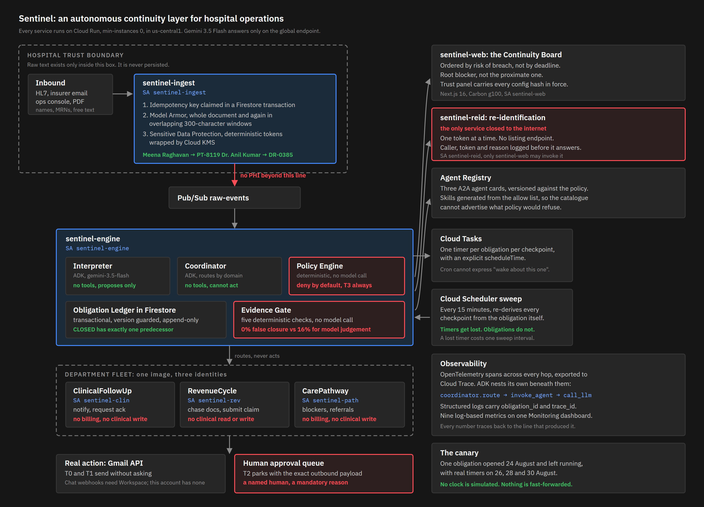

# Sentinel

**Most agents react to events. Sentinel reacts to the absence of events.**

A hackathon prototype for tracking gaps in hospital operations. It watches for
work that may not have happened, records who owns the next step, and follows the
obligation until evidence is supplied.

Built solo in eight days using Gemini 3.5 Flash, Google ADK and Google Cloud.

[Four-minute demo](docs/demo.mp4) | [Architecture](docs/architecture.md) | [Measured results](eval/RESULTS.md)

---

## The problem

Hospitals don't fail because staff don't know their jobs. They fail at the seams:
between shifts, between departments, between a result arriving and someone
noticing.

A critical potassium result comes back and nobody owns the next step. An insurer
asks for one document and the request sits in an inbox. A discharge waits on a
signature nobody chased. These are not knowledge problems. They are continuity
problems, and no existing system owns them, because every existing system is
waiting to be told something happened.

You cannot subscribe to "nothing happened".

---

## Three properties

### 1. It reacts to the absence of events

Every obligation carries its own Cloud Tasks timer with an explicit
`scheduleTime`. Cloud Scheduler is cron and cannot express *wake up about this
particular obligation at 16:00*.

Timers get lost. So a sweep runs every fifteen minutes, re-derives every
checkpoint from the obligation itself, and re-arms anything a dropped task
missed. **The obligation is the source of truth. The timer never is.** Losing a
timer costs one sweep interval rather than the obligation.

This was tested by deleting a live Cloud Task on purpose. The sweep caught it,
re-armed it, and the obligation reached `AT_RISK` anyway.

### 2. Closure goes through deterministic evidence checks

`CLOSED` has exactly one legal predecessor in the state machine, and the only
edge into it runs through the Evidence Gate, which is deterministic code with no
model call inside it. `assert_closed_is_gated()` derives the predecessor set from the
transition table at import and raises if it is ever anything else.

On the thirty-sample evaluation corpus, the gate produced **0% false closure**;
`gemini-3.5-flash` produced **16%** on the same inputs. This is a small fixture
test, not a general safety guarantee. The gate validates submitted evidence
fields against configured rules; it does not independently query the source
system.

### 3. Identifiers are removed before the model path

The ingest service replaces selected identifiers in event text before sending
that text to Gemini. `Meena Raghavan` becomes `PT-8119`, `Dr. Anil Kumar`
becomes `DR-0385`.
Tokenisation is deterministic under a KMS-wrapped key, so the same person maps to
the same token across weeks, which is what makes correlating a multi-day
obligation possible without sending the name down the model path. The original
values are retained in the separate re-identification store so the board can
reverse a token when needed.

Downstream services are intended to persist de-identified event text. Metadata is
caller supplied and is not exhaustively de-identified, so the included fixtures
keep it non-sensitive. Re-identification happens in a separate private service
and each lookup is logged. The current board uses its service identity for these
lookups; it does not provide individual user authentication.

---

## Architecture



Full detail in **[docs/architecture.md](docs/architecture.md)**, including the
obligation state machine and the reasoning behind where the model is fenced.

| Service | Identity | Public | Purpose |
|---|---|---|---|
| `sentinel-ingest` | `sentinel-ingest` | yes | trust boundary: screening and tokenisation |
| `sentinel-engine` | `sentinel-engine` | yes | ledger, timers, interpreter, coordinator, policy, evidence |
| `sentinel-clin` | `sentinel-clin` | yes | clinical follow-up agent |
| `sentinel-rev` | `sentinel-rev` | yes | revenue cycle agent |
| `sentinel-path` | `sentinel-path` | yes | care pathway agent |
| `sentinel-reid` | `sentinel-reid` | **no** | re-identification |
| `sentinel-web` | `sentinel-web` | yes | Continuity Board |

**Stack.** Python 3.12, FastAPI, `google-adk` on `gemini-3.5-flash` via Vertex AI.
Firestore for the ledger, Cloud Tasks for per-obligation timers, Cloud Scheduler
for the sweep, Pub/Sub for fan-out. Sensitive Data Protection and Cloud KMS for
tokenisation, Model Armor for screening. Agent Registry for the fleet catalogue.
OpenTelemetry to Cloud Trace. Next.js 16 and Carbon Design System for the board.
Everything on Cloud Run at `min-instances=0`.

---

## Results

Full method and caveats in **[eval/RESULTS.md](eval/RESULTS.md)**. Reproduce with
`python eval/replay.py --all`.

### Detection

Twelve obligations on the deployed system with a compressed ninety second SLA and
real Cloud Tasks timers. The harness waits in real time.

| | |
|---|---|
| **Detection rate** | **100%** (12 of 12) |
| Median time to detection | **5.6 s** after the deadline |
| Range | 0.2 s to 11.1 s |

There is no status-quo baseline. A useful comparison would be how long the same
lapse currently goes unnoticed in a real hospital, and that was not measured.
This run only reports the prototype's result on the twelve fixtures.

### Evidence rules compared with model judgement

Thirty hand-authored samples, twenty-five of which should not close. Both arms
see identical input.

| | Configured rules | Model judgement |
|---|---|---|
| **False closure rate** | **0.0%** | **16.0%** |
| True closure rate | 100% | 100% |

Within this corpus, both closed everything that qualified under the configured
rules. The model's four failures concerned whether a source was allowed for that
obligation type or whether a timestamp fell inside the acceptance window.

---

## Findings and learnings

**Detecting absence is a different engineering problem from reacting to
presence, and timers alone do not solve it.** The naive design gives each
obligation a timer and stops. That design loses obligations, because a dropped
task is indistinguishable from an obligation that was never due. What makes it
work is treating the timer as disposable: the obligation carries its own next
checkpoint, and a sweep re-derives it from the record. Once the obligation rather
than the timer is authoritative, losing a timer becomes a fifteen-minute delay
instead of a silent failure.

**Model Armor's prompt-injection detection is diluted by surrounding legitimate
text, and this was measured rather than assumed.** The injected paragraph in
`fixtures/injection_claim.pdf` is blocked on its own at 320 characters. The
byte-identical paragraph inside the full 1318-character insurer letter is not
blocked. Screening that letter in windows finds it at 300 characters per window
and misses it at 400 and at 600. The boundary now screens long documents whole
and again in overlapping windows. But that is a mitigation, not a guarantee,
which is why it is not what the system relies on. Fed the injection with
screening bypassed, the interpreter produced an ordinary obligation for the
document the letter was genuinely asking for and kept chasing it. The defence
that held was structural, not filtering.

**Asking a model to tier an action gets you the seriousness of the subject, not
the authority the action needs.** Asked to assign a risk tier to a critical
potassium result, `gemini-3.5-flash` returns T3, the tier reserved for writing
to a clinical record, which is denied for every agent with no approval path. It
was reading how serious the situation was rather than what the system would have
to do about it. That single word would have made the entire critical-lab workflow
permanently undischargeable. The governing risk tier is therefore derived in
code from the obligation type rather than taken from model output. The same
boundary appears elsewhere: the model proposes an SLA and code computes the
dates, while a proposed route still has to pass deterministic policy checks.

**Clinical validation was outside the build window.** The intent was to ground
the three workflows in interviews with hospital staff. That did not happen, so
the workflows are modelled on documented failure modes and should be treated as
plausible prototypes rather than clinically validated workflows.

---

## Spin-up

### What you need

- A Google Cloud project with billing enabled
- `gcloud` CLI, authenticated
- Python 3.12 or newer (3.14 works; all wheels resolve)
- Node.js 20 or newer, for the board
- Windows PowerShell for the `infra` scripts, or read them as a list of `gcloud`
  commands to run on another shell

### 1. Clone and authenticate

```bash
git clone https://github.com/sridharan-kannan-06/sentinel.git sentinel
cd sentinel
gcloud auth login
gcloud auth application-default login
```

`gcloud auth login` and `gcloud auth application-default login` are different
things and you need both. The first authenticates the CLI; the second gives the
Python client libraries credentials.

### 2. Provision

Edit `$PROJECT_ID` and `$BILLING_ACCT` at the top of `infra/setup-gcp.ps1`, then:

```bash
powershell -ExecutionPolicy Bypass -File infra/setup-gcp.ps1
```

This enables the APIs, sets a budget alert, and creates Firestore, Artifact
Registry, the Pub/Sub topics, the Cloud Tasks queue, a GCS bucket, the KMS key,
the wrapped tokenisation key in Secret Manager, seven service accounts with their
roles, and the Model Armor template. It is safe to re-run.

The budget amount must be in your billing account's own currency. A USD amount on
an INR account is rejected as an invalid argument that does not say which one.

### 3. Configure

Copy `.env.example` to `.env` and fill it from the script's output.

```bash
powershell -ExecutionPolicy Bypass -File infra/grant-secrets.ps1
```

### 4. Real email, optional but worth it

In the console: OAuth consent screen, External, add yourself as a test user, add
the scope `https://www.googleapis.com/auth/gmail.send`. Then Credentials, OAuth
client ID, Desktop app, download the JSON.

```bash
python infra/setup_gmail_oauth.py path/to/client_secret.json
```

Approve once in the browser. The refresh token goes to Secret Manager and is
never written to disk. Set `NOTIFIER=gmail` in `.env`.

Without this, set `NOTIFIER=log` and notifications are recorded rather than sent.

### 5. Deploy

Order matters: the agents need the engine's URL and the engine needs theirs.

```bash
powershell -ExecutionPolicy Bypass -File infra/deploy.ps1 -Service engine
powershell -ExecutionPolicy Bypass -File infra/deploy.ps1 -Service ingest
powershell -ExecutionPolicy Bypass -File infra/deploy.ps1 -Service reid
powershell -ExecutionPolicy Bypass -File infra/deploy.ps1 -Service clin
powershell -ExecutionPolicy Bypass -File infra/deploy.ps1 -Service rev
powershell -ExecutionPolicy Bypass -File infra/deploy.ps1 -Service path
powershell -ExecutionPolicy Bypass -File infra/deploy.ps1 -Service engine
powershell -ExecutionPolicy Bypass -File infra/deploy.ps1 -Service web
```

The engine appears twice on purpose. The first deploy creates it so the agents
have a URL; the second gives it theirs.

Each deploy writes the resulting URL back into `.env`.

### 6. Wire the rest

```bash
powershell -ExecutionPolicy Bypass -File infra/setup-pubsub.ps1
powershell -ExecutionPolicy Bypass -File infra/setup-scheduler.ps1
powershell -ExecutionPolicy Bypass -File infra/setup-monitoring.ps1
python infra/register_agents.py --apply
```

### 7. Start the canary

```bash
powershell -ExecutionPolicy Bypass -File infra/start-canary.ps1
```

One obligation with checkpoints days out. Open it once and leave it. Its elapsed
time is real elapsed time.

### Running locally

There is no emulator path. The engine talks to Firestore, Cloud Tasks and Vertex
AI, and the boundary talks to Sensitive Data Protection and Model Armor, so a
local run still needs a provisioned project and application default credentials.
What runs locally is the code, not the infrastructure.

One-time setup:

```bash
python -m venv .venv
.venv/Scripts/python.exe -m pip install -r requirements-dev.txt
```

Then one service at a time:

```bash
powershell -ExecutionPolicy Bypass -File infra/run-local.ps1 -Service web
powershell -ExecutionPolicy Bypass -File infra/run-local.ps1 -Service engine
```

The board comes up on `http://localhost:3000` and the engine on `:8080`.

Use the script rather than starting uvicorn by hand. The services read their
configuration from the environment and uvicorn does not read `.env`, so a service
started without it answers `/health` perfectly well and fails every Firestore
call with `RESOURCE_PROJECT_INVALID`. The script loads `.env`, checks for
credentials, and substitutes the hostname this machine can actually resolve for
any deployed service the local one needs to reach.

Running the board locally against the deployed engine is the useful combination:
you get hot reload on the UI and the real ledger behind it. The board fetches
everything server side, so the engine URL never reaches the browser.

### Tests

Each service deploys with its own `requirements.txt`, which is enough to run that
service but not enough to run its tests. `requirements-dev.txt` pulls all three
together and adds the runner:

```bash
python -m venv .venv
.venv/Scripts/python.exe -m pip install -r requirements-dev.txt
```

Then, from the repository root:

```bash
cd services/engine && python -m pytest -q
cd ../agents      && python -m pytest -q
cd ../ingest      && python -m pytest -q
```

Run them from inside each service directory. The modules import each other flatly
because that is how they are laid out in the container, and `services/agents` has
a `conftest.py` that puts the shared modules on the path the same way the deploy
script stages them.

No network and no credentials required. The tests that matter assert properties
rather than outputs: that `CLOSED` is reachable from exactly one state, that no
agent can reach a T3 action, that screening precedes de-identification within the
ingest pipeline, and that a blocked payload produces no forwardable result there.

---

## Implementation notes

Written down in [docs/architecture.md](docs/architecture.md#implementation-notes).
The short version:

- `gemini-3.5-flash` is served only from `location=global`, not from any region
- `/healthz` is intercepted by Google's edge on `run.app` and never reaches your
  container; use any other path
- Cloud Run serves two hostnames per service, and some networks resolve only one
- A newer `google-api-core` breaks every Firestore transaction on Cloud Run while
  working locally
- Cloud Run's CPU throttling can silently discard batched OpenTelemetry spans

---

## What was not built, and why

### Agent Gateway, deliberately not used

Agent Gateway is the obvious component to reach for on this problem. It is in
private preview and access was not available within the build window, and
designing around a component that could not be exercised would have produced a
diagram that was true and a system that was not.

What was built instead is a policy enforcement point in
`services/engine/policy.py`, governed by `policy/policy.yaml`. Writing it rather
than adopting it forced three decisions a managed gateway would have made
invisibly, and each of them mattered:

**Deny by default in three separate layers.** An undeclared agent has no
permissions, an undeclared action is refused, and a declared action outside that
agent's allow list is refused. A gateway configured by exception tends to allow
by default with a deny list bolted on, and the difference only surfaces the day
somebody adds a tool and forgets the rule.

**T3 is evaluated before the allow list.** Every agent is refused a clinical
write for the same reason, and that reason, which is that this system has no clinical
authority at all, is more useful than the "wrong department" answer the allow
list would have produced.

**The policy decision is inspectable.** Every call returns a decision id, the
current policy version, and a hash of the policy bytes. The prototype exposes
these values for inspection, but does not yet provide a tamper-evident historical
record of every policy configuration.

The enforcement point is also duplicated on purpose: each agent re-checks its own
allow list even though the coordinator already checked. A single gateway is a
single place to be wrong.

### Memory Bank, cut, and the rule it would have needed already holds

Advisory memory scoped to a role would be useful and is not load-bearing. The
rule it would have had to obey is worth stating because the architecture already
enforces it: *memory may change how the agent acts; it may never change whether
an obligation closes.* A poisoned memory could at most cause a badly chosen
notification channel. There is no code path from a remembered preference to a
status change.

### Google Chat, Calendar and Sheets, blocked by account type

Chat incoming webhooks require a Google Workspace account and this project runs
on a consumer account. `services/engine/notify.py` ships three implementations
behind one interface, `gmail`, `sheets` and `log`, so the channel is
configuration. Gmail is what runs.

### Gemma triage, built, measured, switched off

`services/triage` runs Gemma under Ollama with the model baked into the image,
listening only on localhost so the classification never leaves the boundary. It
works, and `eval/triage_eval.py` measures it: 75% accurate at `gemma3:4b`, and
about 44 seconds per classification on Cloud Run CPU.

Forty-four seconds is not something a trust boundary can block for, so the code
path ships disabled. `TRIAGE_URL` unset means ingest skips it. In the sixteen-item
evaluation, no real-work fixture was labelled `none` at either model size. This
is a useful prototype result, but not a general miss-rate claim.

### Public deployment trade-off

For the hackathon deployment, every service except re-identification is publicly
reachable. Those services are intended to receive tokenised text, but that data
can still be operationally sensitive, and some engine endpoints can write state.
The re-identification service is private and is called with the board's service
identity rather than an individual user's identity. Pub/Sub and Cloud Scheduler
already use OIDC; making every remaining service private would also require
authenticated service-to-service calls.

### Out of scope

Production-grade end-user authentication and authorisation, multi-tenancy, a
mobile app, voice, a chat interface, a graph visualisation library, an HL7 or
FHIR parser beyond a single fixture, and Kubernetes.

The fixture set contains twelve subjects. It demonstrates the workflows but is
too small to support general performance claims.
