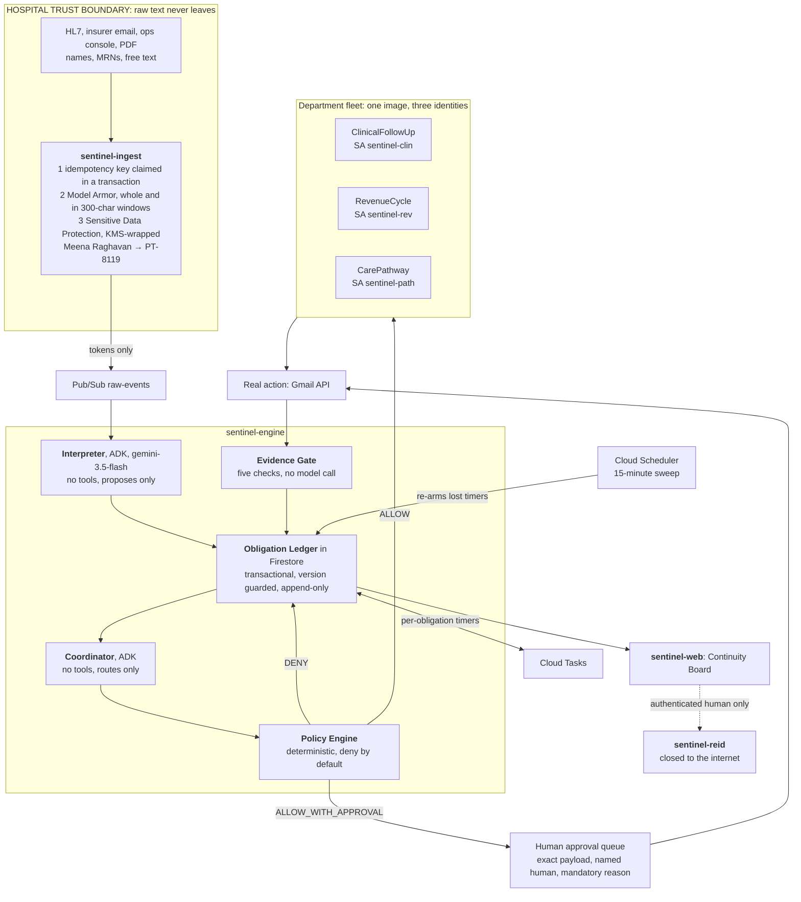
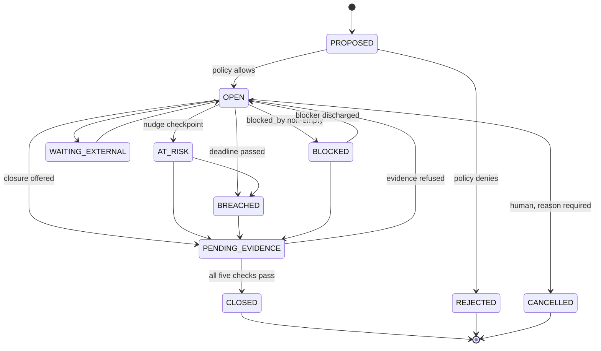

# Architecture

The diagram above is the same system described below. If you only read one
section, read [the three properties](#the-three-properties-everything-else-serves).

---

## The three properties everything else serves

**It reacts to the absence of events.** You cannot subscribe to "nothing
happened". Every obligation carries its own Cloud Tasks timer with an explicit
`scheduleTime`, because cron cannot express *wake up about this particular
obligation at 16:00*. Timers get lost, so a Cloud Scheduler sweep runs every
fifteen minutes and re-derives every checkpoint from the obligation itself. The
obligation is the source of truth; the timer never is.

**The model may propose closure. Only an authoritative external fact may close.**
`CLOSED` has exactly one legal predecessor in the state machine, and the only
edge into it runs through the Evidence Gate, which is deterministic code with no
model call inside it. This is enforced by a table and proved by a test, not by
review.

**The model never sees a patient.** Identifiers are replaced at the trust
boundary before anything reaches Gemini. Tokenisation is deterministic, so the
same person maps to the same token across weeks, which is what makes correlating
a multi-day obligation possible without holding a name anywhere.

---

## Flow

---

## The obligation state machine

An obligation is a commitment the hospital's workflow has implicitly made and
has not yet discharged. Status is written by exactly one function,
`ledger.transition`, inside a Firestore transaction guarded by a version field.

`CLOSED` is reachable from `PENDING_EVIDENCE` and from nowhere else. That is not
a convention; `assert_closed_is_gated()` derives the predecessor set from the
transition table at import time and raises if it is ever anything other than
`{PENDING_EVIDENCE}`.

---

## Why the model is fenced where it is

Gemini is used in exactly two places and is given no tools in either.

The **Interpreter** turns one de-identified event into obligation proposals. It
cannot write, and its output is checked against reality before anything is
admitted: the obligation type must be in a closed vocabulary of five, the subject
token must actually appear in the event, the SLA must be inside a permitted
range, and the required evidence must be non-empty.

It is also not allowed to do date arithmetic. It proposes an SLA in hours and
deterministic code derives the deadline and the three checkpoints. Models are
poor at calendars and a hallucinated timestamp would silently corrupt a timer.

The **Coordinator** decides which department owes the next move. Its vocabulary
is generated from `policy.yaml` at runtime, so what the model is offered cannot
drift from what the policy engine will accept. Its choice is then checked by the
policy engine, which is deterministic and has no model call anywhere inside it.

### Risk tier is derived, not taken

Asked to tier a critical potassium result, the model returns **T3**. It is
reading the clinical seriousness of the subject rather than the authority the
agent needs. T3 is a permanent denial with no approval path, so accepting that
one word would have made the entire critical-lab workflow undischargeable.

The tier that governs is derived in code from the obligation type. The model's
suggestion is kept alongside and shown in the trust panel, because a disagreement
between the two is worth looking at.

---

## Authority

`policy/policy.yaml` is the whole authority model, as versioned data. Its hash is
logged at boot, returned with every decision, and shown on every page of the
board, so a decision recorded in the ledger can be tied to the exact
configuration that produced it.

Deny by default, in three layers: an undeclared agent has no permissions, an
undeclared action is refused, and a declared action outside that agent's allow
list is refused. Only then does the tier decide.

| Tier | Example | Handling |
|---|---|---|
| T0 | internal notification, board update | automatic |
| T1 | internal task, document request | automatic |
| T2 | external email, claim submission, patient contact | **human approval** |
| T3 | write a clinical record, express a clinical opinion | **denied, always** |

T3 is checked **before** the allow list, deliberately. Every agent is refused a
clinical write for the same reason, and that reason is the interesting one:
Sentinel has no clinical authority at all. Reaching the refusal through the allow
list instead would report the narrower and less true "wrong department".

No obligation type maps to T3. An obligation whose discharge required a T3 action
could never be discharged.

### Two layers, not one

Each agent runs as its own service account and re-checks its own allow list on
every action, even though the coordinator already checked before dispatching. A
coordinator bug, a replayed request, or a caller that skipped the coordinator
entirely all still meet a closed door. At boot each container verifies that the
role it declares matches the identity it actually runs as, read from the
metadata server, and refuses to start if they disagree.

---

## What closes an obligation

Five deterministic checks in `policy/evidence.yaml`, all of which must pass:

1. the source is on the authoritative list **for this obligation type**
2. an external reference id is present
3. the timestamp is inside the acceptance window and after the obligation opened
4. the subject token matches the obligation's subject
5. the assertion describes the required evidence

Measured against thirty samples: **0% false closure** for the gate, **16%** for
the same corpus judged by `gemini-3.5-flash`. Both closed 100% of what genuinely
qualified, so the gate is not merely refusing things. See
[eval/RESULTS.md](../eval/RESULTS.md).

`EVIDENCE_GATE=off` exists for the ablation. With it off the checks still run and
are still recorded, and only the verdict is ignored, so the audit trail shows
which checks were skipped rather than going quiet.

---

## What the injection fixture showed

`fixtures/injection_claim.pdf` is a plausible TPA letter with an embedded
instruction to close the claim.

**Model Armor's prompt-injection detection is diluted by surrounding legitimate
text.** The injected paragraph alone is blocked at 320 characters. The
byte-identical paragraph inside the 1318-character letter is not. Screening the
letter in windows finds it at 300 characters per window and misses it at 400 and
600.

The boundary therefore screens long documents whole and again in overlapping
windows. That is a mitigation and not a guarantee, which is why it is not what
the system relies on. Fed the injection with screening bypassed, the interpreter
produced an ordinary pre-authorisation obligation for the consultant's note the
letter was genuinely asking for, and it kept chasing the real document. No tools,
no closure in its vocabulary, one legal predecessor to `CLOSED`.

---

## Deployment

| Service | Identity | Public | Purpose |
|---|---|---|---|
| `sentinel-ingest` | `sentinel-ingest` | yes | trust boundary |
| `sentinel-engine` | `sentinel-engine` | yes | ledger, timers, interpreter, coordinator, policy, evidence |
| `sentinel-clin` | `sentinel-clin` | yes | clinical follow-up |
| `sentinel-rev` | `sentinel-rev` | yes | revenue cycle |
| `sentinel-path` | `sentinel-path` | yes | care pathway |
| `sentinel-reid` | `sentinel-reid` | **no** | re-identification |
| `sentinel-web` | `sentinel-web` | yes | Continuity Board |

Every service is public except the one that can turn a token back into a name.
The public ones hold nothing worth reading.

The three agents are one image deployed three times. What differs is the service
account and the `AGENT_ROLE` it declares. Three separate codebases would have
been three times the deploy surface for no additional isolation, since the
isolation comes from IAM and from policy rather than from the code being
separate.

`infra/deploy.ps1` stages each build into a temporary directory and copies the
canonical `policy/*.yaml` in alongside the service's own files, because Docker
cannot reach above its build context and duplicating the authority model into
several directories would let it drift.

---

## Things that cost hours and are written down so they cost nobody else any

**`gemini-3.5-flash` is served only from `location=global`.** Every other service
in the project is regional. The regional endpoint returns a 404 saying the
publisher model does not exist, which reads like a wrong model name.

**`/healthz` is intercepted by Google's edge on `run.app` hostnames** and
answered with its own 404 before the request reaches the container. Every other
path routes normally. A service with a `/healthz` health check looks exactly like
a service that failed to deploy. The endpoints here are `/health`.

**Cloud Run serves two hostnames per service.** Some networks refuse to resolve
`SERVICE-NUMBER.REGION.run.app` while resolving `SERVICE-HASH-uc.a.run.app`
fine. Both work; if one will not resolve, try the other before assuming the
deployment is broken.

**A newer `google-api-core` percent-encodes the Firestore database id**, so every
transaction fails with `400 Invalid database id %28default%29` while the same
code works locally. The rollback path then masks it with a second error about a
missing transaction id. It is pinned in all four Python services.

**Cloud Run throttles CPU to near zero once a request returns**, so a batched
OpenTelemetry span processor may never flush before the instance is reclaimed.
Span export here is synchronous.

**Turbopack cannot resolve Carbon's internal relative Sass imports.** The board's
build pins webpack.
